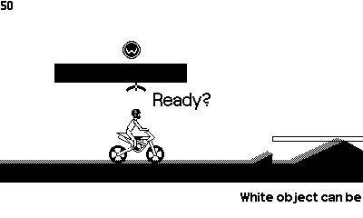

# Wheelsprung (Playdate)




A physics-based motocross-platformer for the Playdate console. Made with the Nim programming language and the Chipmunk2D physics library for playdate. It relies on 2 libraries for that:

[Playdate-Nim][pdnim]

[Chipmunk2D for Playdate](https://github.com/samdze/chipmunk-2d)

## Level Editor
A public level editor is available. See the [guide on the Wiki][editor] for installation and usage instructions.

## Installation
NOTE: Although this repository is publicly available, the level files are not. You may be able to compile the project, but will have to provide your own level files to run the game.

This project should work on MacOS and Windows. See [Playdate-Nim][pdnim] for installation instructions.


## Troubleshooting
As noted above, the level files are not included. This may be a cause for crashes.

### Make sure you can run the playdate-nim sample project
See [Playdate-Nim][pdnim] for installation instructions.

### Linux support
All the necessities to run on Linux should be in place, but the Linux build target is not maintained and last checked a long time ago. 

## Development
As noted above, the level files are not included. This may be a cause for crashes.

### Analyze device crashes

Reboot to Datadisk and open `crashlox.txt`. Look at the `pc` value.

If PC value starts with `0x6` on rev A or `0x9` on revB, the crash is in game code

Remove the aforementioned prefixes. eg. for `pc:60015036` use `0x15036` `and run

```
arm-none-eabi-gdb ./source/pdex.elf
(gdb) info line *0x15036
```


### Level hash updater

```
./scripts/run_level_updater.sh
```

### Tiled extension
To build the Tiled extension every time you save changes to the typescript files:

```
cd editor/extensions
npm run watch
```

...or select the Node.js > Run Script: watch from the Run and Debug dropdown

### Chipmunk
The Chipmunk physics library comes bundled as a pre-compiled static library. For future reference; this is how I was able to compile it for Mac and Linux. For Windows, I used [tdm-gcc][tdm-gcc].

```
mkdir build
cd build
cmake --fresh -G "MinGW Makefiles" -D BUILD_STATIC=ON -D BUILD_SHARED=OFF -D BUILD_DEMOS=OFF -D INSTALL_STATIC=OFF -D CMAKE_BUILD_TYPE=Debug -D PLAYDATE=ON ../
cmake --build .
```

The resulting lib is placed in the [lib](./lib) folder.


### Level Editor build
The level editor build contains binaries for Windows and Mac simulators + device.

1. Execute Build & Run Simulator PDX (mac build)
2. Execute Build & Run Device PDX
3. On windows, execute `nimble simulate`
4. Copy the generated `pdex.dll` from the winfows build output to `wheelsprung.pdx` in the Max outputs. This should now contain `pdex.dll`, `pdex.dyLib`, and `pdex.bin`
5. Executue `./scripts/bundle_editor` on the mac machine


[pdnim]: https://github.com/samdze/playdate-nim/tree/main/playdate_example
[editor]: https://github.com/ninovanhooff/wheelsprung/wiki/Level-Editor
[tdm-gcc]: https://jmeubank.github.io/tdm-gcc/