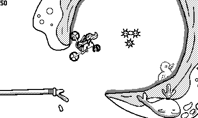

# Playdate Dirtbike Example




This sample project demonstrates how to use the Nim programming language with the Chipmunk2D physics library for playdate. It relies on 2 libraries for that:

[Playdate-Nim][pdnim]

[Chipmunk2D for Playdate](https://github.com/samdze/chipmunk-2d)

## Installation
This project should workk MacOS with Apple Silicon and Windows. See [Playdate-Nim][pdnim] for installation instructions.


## Troubleshooting


### Make sure you can run the playdate-nim sample project
See [Playdate-Nim][pdnim] for installation instructions.

### Linux support
This project needs Chipmunk as **static** library. This is provided for the windows simulator(64 bit), MacOs simulator(Apple silicon), and the playdate device. For other platforms, I appreciate a Pull Request.

I compiled the windows lib, by installing Msys2, and adding the C build tools for MinGW (make and cmake). Then, I could build `libchipmunk.a` with 

```
mkdir build
cd build
cmake --fresh -G "MinGW Makefiles" -D BUILD_STATIC=ON -D BUILD_SHARED=OFF -D BUILD_DEMOS=OFF -D INSTALL_STATIC=OFF -D CMAKE_BUILD_TYPE=Debug -D PLAYDATE=ON ../
cmake --build .
```

The resulting lib is placed in the [lib](./lib) folder.


[pdnim]: https://github.com/samdze/playdate-nim/tree/main/playdate_example